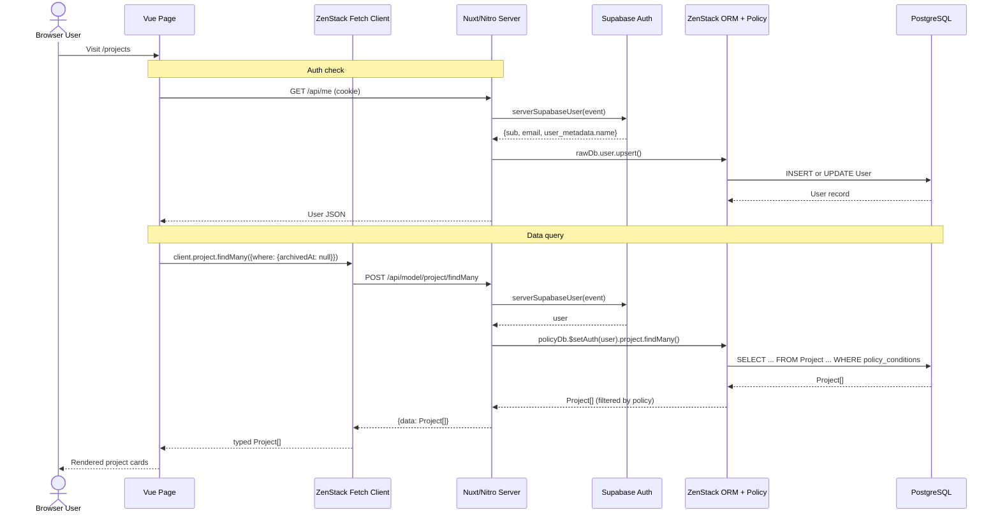
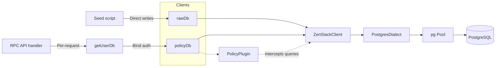
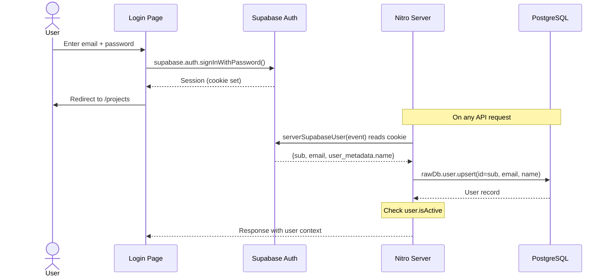
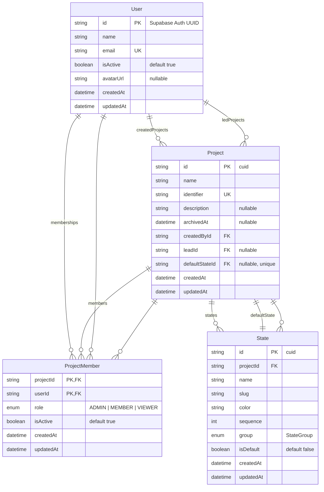
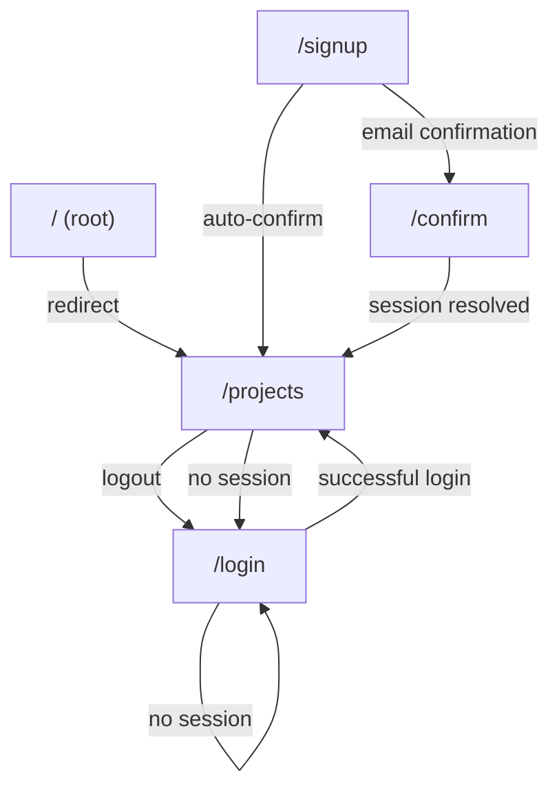

# Project Overview — Plane Light

---

## 1. Project Overview

### Purpose
Plane Light is a lightweight Kanban/Scrum project management tool. It lets teams create projects, organize work into kanban columns (states), manage members with role-based access, and track tasks.

### Problem it solves
Self-hosted, single-tenant project management without the complexity of multi-workspace SaaS tools. Inspired by [Plane](https://plane.so), it strips away multi-tenancy, pages, modules, notifications, integrations, and real-time collaboration to focus on the core Kanban+Scrum loop.

### Target users
Development teams and small organizations that need a simple, self-hosted project tracker. Single-tenant means one workspace per deployment.

### Current development status
**Early development (Phase 1: Kanban core, partial).** The database schema, data layer, authentication, and one page (project listing) are implemented. Issues, sprints, labels, comments, boards, and detail views are planned but not yet built.

*Source: `docs/plan-design.md` (857-line design document), `zenstack/schema.zmodel` (4 models implemented vs. ~10 planned)*

---

## 2. Technology Stack

| Technology | Version | Purpose | Configuration |
|---|---|---|---|
| **Nuxt 4** | ^4.4.8 | Full-stack Vue framework with file-based routing, SSR/SSG, and Nitro server engine | `nuxt.config.ts` |
| **Vue 3** | ^3.5.38 | Frontend UI framework (Composition API, `<script setup>`) | — |
| **Vue Router** | ^5.1.0 | Client-side routing (Nuxt-managed) | `nuxt.config.ts` |
| **Nitro** | (Nuxt 4 built-in) | Server engine — handles API routes, middleware, SSR | `server/` directory |
| **TypeScript** | (Nuxt default) | Type safety throughout the stack | `tsconfig.json` |
| **PostgreSQL** | — | Primary database | `DATABASE_URL` in `.env` |
| **Supabase Auth** | — | Authentication provider (email/password, magic link, OAuth) | `nuxt.config.ts` → `@nuxtjs/supabase` |
| **@nuxtjs/supabase** | ^2.0.9 | Nuxt module wrapping Supabase JS client | `nuxt.config.ts` |
| **ZenStack V3** | ^3.8.2 | ORM + access control layer (Prisma-compatible API on top of Kysely) | `zenstack/schema.zmodel`, `server/lib/zenstack.ts` |
| **@zenstackhq/orm** | ^3.8.2 | ZenStack ORM client (create, read, update, delete, transactions, raw SQL) | `server/lib/zenstack.ts` |
| **@zenstackhq/server** | ^3.8.2 | Server adapters (RPC API handler, Nuxt integration) | `server/api/model/[...].ts` |
| **@zenstackhq/fetch-client** | ^3.8.2 | Typed fetch client for browser-side queries | `app/utils/zenstack-client.ts` |
| **@zenstackhq/plugin-policy** | 3.8.2 | Access policy enforcement plugin for ZModel @@allow/@@deny rules | `server/lib/zenstack.ts` |
| **@zenstackhq/schema** | ^3.8.2 | Schema definition runtime (ExpressionUtils, SchemaDef base) | `zenstack/schema.ts` (generated) |
| **@zenstackhq/cli** | ^3.8.2 | CLI for `zen generate`, `zen migrate`, `zen db seed`, `zen check` | `package.json` → `zenstack.seed` |
| **Prisma** | (ZenStack peer dep) | Migration engine (used under the hood by `zen migrate`) | `zenstack/migrations/` |
| **pg** | ^8.22.0 | PostgreSQL driver for Node.js | `server/lib/zenstack.ts` |
| **Nuxt UI v4** | ^4.9.0 | 125+ accessible Vue components built with Tailwind CSS | `nuxt.config.ts`, `app/assets/css/main.css` |
| **Tailwind CSS v4** | ^4.3.2 | Utility-first CSS framework | `app/assets/css/main.css` |
| **@iconify-json/lucide** | ^1.2.115 | Lucide icon set (accessed via `i-lucide-*` in Nuxt UI) | — |
| **Zod** | ^4.4.3 | Runtime schema validation (forms, env vars, API inputs) | `env.ts`, `app/pages/(app)/projects.vue`, `app/pages/(auth)/login.vue`, `app/pages/(auth)/signup.vue` |
| **@t3-oss/env-nuxt** | ^0.13.11 | Environment variable validation with Zod schemas | `env.ts` |
| **pnpm** | 11.10.0 | Fast, disk-efficient package manager | `pnpm-workspace.yaml` |
| **tsx** | ^4.23.0 | TypeScript execution for seed scripts | `package.json` → `zenstack.seed` |

### Not detected
- **Testing framework**: Not configured (no Jest, Vitest, Playwright, etc.)
- **CI/CD**: No GitHub Actions, GitLab CI, or other pipeline config
- **Linting**: No ESLint or Prettier config (Nuxt UI may include some defaults)
- **Bundle analyzer**: Not configured
- **Commit hooks**: No husky or lint-staged
- **Containerization**: No Dockerfile

---

## 3. Project Architecture

### Folder structure

```
experiment-plan-nuxt-zenstack/
├── .agents/                     # AI coding assistant skill files (11 skill packs)
│   └── skills/
│       ├── nuxt/
│       ├── nuxt-ui/
│       └── zenstack-*/          # 9 ZenStack skill packs
├── .nuxt/                       # Nuxt generated files (gitignored)
├── .output/                     # Build output (gitignored)
├── app/                         # Vue application (browser + server components)
│   ├── app.vue                  # Root component
│   ├── assets/css/main.css      # Global CSS (Tailwind + Nuxt UI imports)
│   ├── components/
│   │   └── AppSidePanel.vue     # Reusable drawer/side panel
│   ├── composables/
│   │   └── useAppHeader.ts      # Header state (breadcrumbs, actions)
│   ├── layouts/
│   │   ├── app.vue              # Authenticated app shell
│   │   └── default.vue          # Minimal layout for auth pages
│   ├── middleware/
│   │   └── auth.global.ts       # Global route guard
│   ├── pages/
│   │   ├── (app)/
│   │   │   └── projects.vue     # Project listing (protected)
│   │   └── (auth)/
│   │       ├── confirm.vue      # Email confirmation handler
│   │       ├── login.vue        # Login form
│   │       └── signup.vue       # Registration form
│   └── utils/
│       └── zenstack-client.ts   # Typed ZenStack fetch client
├── docs/
│   ├── plan-design.md           # Full product design document (857 lines)
│   ├── project-overview.md      # This file
│   └── zenstack.md              # ZenStack usage documentation
├── public/
│   ├── favicon.ico              # Default Nuxt favicon
│   └── robots.txt               # Allows all crawlers
├── server/
│   ├── api/
│   │   ├── me.get.ts            # GET /api/me — current user profile
│   │   └── model/
│   │       └── [...].ts         # Catch-all ZenStack RPC endpoint
│   └── lib/
│       └── zenstack.ts          # DB client setup, auth bridge
├── zenstack/
│   ├── schema.zmodel            # Source data model (ZModel language)
│   ├── schema.ts                # Generated full schema (server)
│   ├── schema-lite.ts           # Generated lite schema (browser)
│   ├── input.ts                 # Generated TypeScript input types
│   ├── models.ts                # Generated model type exports
│   ├── seed.ts                  # Database seeder (Supabase Auth + local DB)
│   └── migrations/
│       ├── migration_lock.toml
│       ├── 20260702113151_create_user_table/
│       │   └── migration.sql
│       ├── 20260702212808_create_projects_states_memberships/
│       │   └── migration.sql
│       └── 20260703151000_add_project_creator/
│           └── migration.sql
├── .env                         # Local environment variables (gitignored)
├── env.ts                       # Env var validation (Zod)
├── nuxt.config.ts               # Nuxt configuration
├── package.json                 # Dependencies and scripts
├── pnpm-lock.yaml               # Lock file
├── pnpm-workspace.yaml          # Workspace config
├── skills-lock.json             # AI agent skills lock
└── tsconfig.json                # TypeScript config
```

### Layers and responsibilities

```
┌─────────────────────────────────────────────────────────────┐
│                    Presentation Layer                        │
│  app/ (Vue SFCs, composables, components, layouts, pages)   │
│  • Pages: login, signup, confirm, projects                   │
│  • Components: AppSidePanel                                  │
│  • Composables: useAppHeader, useZenStackClient              │
│  • Auto-imported utils                                       │
├─────────────────────────────────────────────────────────────┤
│                    API / Server Layer                         │
│  server/ (Nitro routes, middleware, lib)                     │
│  • GET /api/me — auth user profile                           │
│  • POST /api/model/* — ZenStack RPC (CRUD)                   │
│  • zenstack.ts — DB client, auth bridge                      │
├─────────────────────────────────────────────────────────────┤
│                    Data / ORM Layer                           │
│  zenstack/ (schema, generated code, migrations, seed)        │
│  • schema.zmodel — source of truth                            │
│  • schema.ts / input.ts / models.ts — generated types         │
│  • @zenstackhq/orm + @zenstackhq/plugin-policy                │
├─────────────────────────────────────────────────────────────┤
│                    Database Layer                              │
│  PostgreSQL                                                   │
│  • Tables: User, Project, ProjectMember, State                │
│  • Enums: Role, StateGroup                                    │
│  • Migrations tracked in zenstack/migrations/                 │
└─────────────────────────────────────────────────────────────┘
```

### Data flow



### Request lifecycle

1. **Browser -> Nuxt**: User navigates to a route (e.g., `/projects`)
2. **Auth middleware** (`app/middleware/auth.global.ts`): Checks `useSupabaseSession()` — if no session and route is in `(app)` group, redirects to `/login`
3. **Layout resolution**: Nuxt applies `appLayout: "app"` for `/projects` routes (configured in `nuxt.config.ts` routeRules)
4. **Page load**: Vue page component mounts
5. **Server data**: `useFetch("/api/me")` and `useAsyncData` with `client.project.findMany()` fetch data during SSR
6. **Client hydration**: Page becomes interactive, forms work, UDrawer panels open

### API architecture

The project uses **ZenStack RPC API** — a single catch-all endpoint (`/api/model/[...].ts`) that exposes CRUD operations for models. The pattern is:

```
POST /api/model/{model}/{operation}   e.g. POST /api/model/project/findMany
```

The `RPCApiHandler` from `@zenstackhq/server/api` translates HTTP requests into ORM calls. The Nuxt-specific wrapper `createEventHandler` from `@zenstackhq/server/nuxt` integrates with Nitro.

Only `Project` and `ProjectMember` are currently exposed (via `slicing.includedModels`).

Server custom endpoints:
- `GET /api/me` — returns the current authenticated user profile

### Database access pattern



- **`rawDb`**: Bypasses all access policies. Used for trusted bootstrap operations (user upsert during login, database seeding). Source: `server/lib/zenstack.ts:9-15`
- **`policyDb`**: Wraps `rawDb` with `PolicyPlugin`. Used for all user-facing operations. Source: `server/lib/zenstack.ts:18`
- **`getUserDb(event)`**: Creates a policy-bound client by calling `getCurrentUser(event)` then `policyDb.$setAuth(user)`. Source: `server/lib/zenstack.ts:68-70`

### Authentication flow



### Authorization

Authorization has two layers:

1. **Supabase Auth session**: The global middleware (`app/middleware/auth.global.ts`) redirects unauthenticated users to login. Session validation happens on every API call via `serverSupabaseUser(event)`.

2. **ZenStack access policies**: Defined in `zenstack/schema.zmodel` using `@@allow` and `@@deny`:
   - **User**: Readable by self or any active member of a project the user belongs to. Updateable only by self.
   - **Project**: Creatable by self. Readable by any active project member. Update/delete by admin members only.
   - **ProjectMember**: Readable by project members. Bootstrap rule allows creator to add self as admin during project creation. Manageable by project admins.
   - **State**: Readable by project members. Manageable by project admins. Default state cannot be deleted.

### Error handling

- **API errors**: Nuxt/Nitro's `createError` throws structured errors with `statusCode` and `statusMessage`. Caught in Vue pages with `try/catch` and displayed via `UAlert`.
- **Auth errors**: Supabase returns `{error}` objects which are caught and displayed.
- **Policy rejections**: ZenStack policy plugin throws on unauthorized access, returned as HTTP errors by the RPC handler.
- **No global error handler** detected.

### Validation strategy

- **Frontend forms**: Zod schemas defined in each page component (e.g., `createProjectSchema` in `projects.vue`, login schema, signup schema with `.refine()` for password matching).
- **Environment variables**: Validated at startup by `@t3-oss/env-nuxt` with Zod schemas in `env.ts`.
- **Database**: Constraints enforced at PostgreSQL level (FOREIGN KEY, UNIQUE, NOT NULL, CHECK? via enums). ZenStack's `@email` attribute on User.email adds validation at the ORM level.
- **No API-level request validation** beyond what the ZenStack ORM provides.

### Configuration management

- **Nuxt config**: `nuxt.config.ts` — modules, Supabase, route rules, devtools
- **Env vars**: Validated by `env.ts` at build/startup. Required: `DATABASE_URL`, `SUPABASE_URL`, `SUPABASE_PUBLIC_KEY`
- **Runtime config**: Not detected (no `publicRuntimeConfig` or `appConfig`)

---

## 4. UI Design System

### Component library
**Nuxt UI v4** — 125+ accessible Vue components built on Tailwind CSS. Imported as `@nuxt/ui` module in `nuxt.config.ts`. No custom theme configuration detected (uses defaults).

### Design system
No custom theme tokens detected. Nuxt UI uses its default design system. The app imports Tailwind CSS v4 and Nuxt UI in `app/assets/css/main.css`:
```css
@import "tailwindcss";
@import "@nuxt/ui";
```

### Color palette
Not customized — uses **Nuxt UI default palette** (neutral gray + primary blue). Tailwind CSS v4 utilities used directly in templates.

### Typography
Nuxt UI defaults. No custom fonts detected.

### Spacing system
Tailwind CSS v4 spacing scale. Uses utilities like `space-y-4`, `space-y-6`, `gap-2`, `gap-4`, `px-4`, `py-6`, `pt-6`.

### Icons
**Lucide** via `@iconify-json/lucide`. Used with the `i-lucide-*` format in Nuxt UI components. Icons found in the codebase:
- `i-lucide-plus` (create project, new project)
- `i-lucide-alert-circle` (errors)
- `i-lucide-check-circle` (success)
- `i-lucide-folder-kanban` (empty state)
- `i-lucide-lock` (login page)
- `i-lucide-user-plus` (signup page)
- `i-lucide-loader-circle` (loading spinner)
- `i-lucide-user` (account menu)
- `i-lucide-sun-moon`, `i-lucide-sun`, `i-lucide-moon` (theme switcher)
- `i-lucide-settings` (profile settings)
- `i-lucide-log-out` (sign out)
- `i-lucide-kanban` (app branding)

### Layout patterns
- **Auth pages**: Centered card layout (`flex min-h-dvh items-center justify-center`)
- **App pages**: Container layout with header (UHeader), breadcrumbs, primary action button, and account dropdown
- **Side panel**: Right-anchored drawer (UDrawer) for forms

### Responsive strategy
- Grid layout: `grid gap-4 md:grid-cols-2 xl:grid-cols-3` (project cards)
- Side panel: `w-full sm:max-w-md` (full width on mobile, constrained on desktop)
- Default Nuxt UI responsive utilities

### Dark/light mode
Built-in via Nuxt UI + Tailwind. The app layout (`app/layouts/app.vue`) includes a theme switcher dropdown with Light, Dark, and System options using `useColorMode()`.

### Accessibility
Nuxt UI components are built with accessibility in mind (ARIA attributes, keyboard navigation, focus management). No custom accessibility audit or additions detected.

### Component guide

#### `AppSidePanel`

| Aspect | Details |
|--------|---------|
| **Purpose** | Reusable right-anchored drawer for forms and secondary content |
| **Props** | `title: string`, `description?: string`, `contentClass?: string` (default: `"w-full sm:max-w-md"`) |
| **v-model** | `open: boolean` — visibility control |
| **Slots** | default (body content), `footer` |
| **States** | Open, closed, transitioning |
| **Where used** | `app/pages/(app)/projects.vue` — New project creation form |
| **Example** | `<AppSidePanel v-model:open="createProjectOpen" title="New project" description="..."> <form /> <template #footer> <UButton /></template> </AppSidePanel>` |

#### Built-in Nuxt UI components used

| Component | Where | Purpose |
|-----------|-------|---------|
| `UApp` | `app.vue` | Root app wrapper |
| `UHeader` | `app/layouts/app.vue` | App header with branding, breadcrumbs, actions |
| `UBreadcrumb` | `app/layouts/app.vue` | Breadcrumb navigation |
| `UDropdownMenu` | `app/layouts/app.vue` | Account menu with theme switcher and logout |
| `UButton` | Multiple | Actions, form submit, navigation |
| `UDrawer` | `AppSidePanel.vue` | Right-side panel |
| `UContainer` | `projects.vue` | Content container |
| `UAlert` | `projects.vue`, `login.vue`, `signup.vue` | Error/success messages |
| `UPageCard` | `projects.vue` | Project display cards |
| `UEmpty` | `projects.vue` | Empty state ("No projects yet") |
| `UForm` | `projects.vue` | Form wrapper with Zod validation |
| `UFormField` | `projects.vue` | Form field with label |
| `UInput` | `projects.vue` | Text input |
| `UTextarea` | `projects.vue` | Textarea |
| `UBadge` | `projects.vue` | Identifier badge |
| `UAuthForm` | `login.vue`, `signup.vue` | Auth-specific form layout |
| `ULink` | `login.vue`, `signup.vue` | Navigation links |
| `UIcon` | `confirm.vue` | Loading spinner |
| `UCard` | `confirm.vue` | Confirmation card |
| `UMain` | `app/layouts/app.vue` | Main content area |
| `NuxtRouteAnnouncer` | `app.vue` | Accessibility route announcer |
| `NuxtLayout` | `app.vue` | Layout system |
| `NuxtPage` | `app.vue` | Page rendering |

---

## 5. Features

### 5.1 Authentication

| Aspect | Details |
|--------|---------|
| **Purpose** | Allow users to sign up, log in, and manage sessions |
| **User flow** | 1) Sign up with name/email/password → 2) Confirm email (if required) → 3) Log in → 4) Access protected pages → 5) Log out |
| **Pages** | `/login`, `/signup`, `/confirm` |
| **Components** | `UAuthForm`, `UAlert`, `ULink`, `UCard` |
| **API endpoints** | None (Supabase handles auth directly from the browser) |
| **Database models** | `User` (local profile, upserted on first login) |
| **Validation** | Zod: email format, password min 8 chars, confirmPassword match, acceptTerms required |
| **Business rules** | Inactive users (`isActive: false`) are rejected with 403 on API calls |

### 5.2 Project listing and creation

| Aspect | Details |
|--------|---------|
| **Purpose** | View all active projects and create new ones |
| **User flow** | 1) See project grid → 2) Click "New project" → 3) Fill form (name, identifier, description) → 4) Submit → 5) See new project in grid |
| **Pages** | `/projects` |
| **Components** | `AppSidePanel`, `UPageCard`, `UEmpty`, `UForm`, `UFormField`, `UInput`, `UTextarea`, `UBadge`, `UButton`, `UAlert` |
| **API endpoints** | `POST /api/model/project/create` (via ZenStack RPC) |
| **Database models** | `Project`, `ProjectMember` |
| **Validation** | Zod: name required, identifier 2-10 chars alphanumeric, description optional |
| **Business rules** | Creator auto-added as admin member; identifier uppercased; archived projects excluded from listing |

### 5.3 Theme switching

| Aspect | Details |
|--------|---------|
| **Purpose** | Toggle between light, dark, and system color modes |
| **User flow** | Click account dropdown → Theme → Select Light/Dark/System |
| **Components** | `UDropdownMenu` |
| **API** | None (client-side only) |
| **Implementation** | `useColorMode()` from Nuxt UI |

### 5.4 Planned features (not yet implemented)

Based on `docs/plan-design.md`:

| Feature | Status | Models needed |
|---------|--------|---------------|
| Kanban board view | Planned | `Issue`, `State` (exists) |
| Issue CRUD | Planned | `Issue` |
| Sprints/Cycles | Planned | `Sprint` |
| Labels | Planned | `Label` |
| Comments | Planned | `Comment` |
| Issue assignees | Planned | `issue_assignees` join |
| Issue detail view | Planned | — |
| List view | Planned | — |
| Filters | Planned | — |

---

## 6. Database

### Technology
**PostgreSQL**. Configured in `zenstack/schema.zmodel` via `datasource db { provider = 'postgresql' }`. All migration SQL targets PostgreSQL dialect.

### Schema



### Enums

```sql
CREATE TYPE "Role" AS ENUM ('admin', 'member', 'viewer');
CREATE TYPE "StateGroup" AS ENUM ('backlog', 'unstarted', 'started', 'completed', 'cancelled');
```

Map to ZModel enum values: `ADMIN → admin`, `MEMBER → member`, `VIEWER → viewer`, `BACKLOG → backlog`, etc. The `@map` attribute handles the mapping.

### Models

#### User
- **Purpose**: Represents an authenticated person
- **Id strategy**: Uses Supabase Auth UUID as primary key (string, not auto-generated)
- **Key fields**: `name`, `email` (unique, validated as email), `isActive` (default true), `avatarUrl` (optional)
- **Relations**: createdProjects, ledProjects, memberships
- **Indexes**: Unique on email

#### Project
- **Purpose**: Top-level work container
- **Id strategy**: Auto-generated CUID
- **Key fields**: `name`, `identifier` (globally unique, short code like "WEB"), `description` (optional), `archivedAt` (optional)
- **Relations**: createdBy (User, Restrict), lead (User?, SetNull), defaultState (State?, SetNull), members, states
- **Indexes**: Unique identifier, index on archivedAt

#### ProjectMember
- **Purpose**: Links users to projects with a role
- **Id strategy**: Composite primary key (projectId, userId)
- **Key fields**: `role` (Role enum, default MEMBER), `isActive` (default true)
- **Relations**: project (Cascade), user (Cascade)
- **Indexes**: (projectId, role), (userId)

#### State
- **Purpose**: Kanban column / workflow state
- **Id strategy**: Auto-generated CUID
- **Key fields**: `name`, `slug` (URL-friendly), `color` (hex), `sequence` (ordering), `group` (StateGroup enum), `isDefault` (boolean)
- **Relations**: project (Cascade), defaultForProject (Project?)
- **Constraints**: Unique (projectId, name), Unique (projectId, slug), Cannot delete default state
- **Indexes**: (projectId, sequence), (projectId, group)

### Foreign key constraints

| FK | From | To | On Delete |
|----|------|----|-----------|
| `Project.createdById` | Project | User | RESTRICT |
| `Project.leadId` | Project | User | SET NULL |
| `Project.defaultStateId` | Project | State | SET NULL |
| `ProjectMember.projectId` | ProjectMember | Project | CASCADE |
| `ProjectMember.userId` | ProjectMember | User | CASCADE |
| `State.projectId` | State | Project | CASCADE |

### Migrations

Three tracked migrations in `zenstack/migrations/`:

| Migration | Date | Changes |
|-----------|------|---------|
| `create_user_table` | 2026-07-02 | User table + indexes |
| `create_projects_states_memberships` | 2026-07-02 | Role/StateGroup enums, Project/ProjectMember/State tables, FKs, indexes |
| `add_project_creator` | 2026-07-03 | Add createdById to Project with backfill and FK |

Migration engine is PostgreSQL (locked in `migration_lock.toml`).

### Seed data

A custom seed script at `zenstack/seed.ts` (created as part of a prior task) populates:
- 10 Supabase Auth users (with auto-confirmed emails)
- 10 local User records (matching Supabase IDs)
- 6 projects (5 active, 1 archived)
- 20 project memberships (mixed roles, some inactive)
- 29 states across all projects (covering all 5 StateGroup values)

Run with: `pnpm db:seed` or `zen db seed`

---

## 7. API

### Routes

| Route | Method | Handler | Purpose |
|-------|--------|---------|---------|
| `/api/me` | GET | `server/api/me.get.ts` | Returns current authenticated user profile |
| `/api/model/*` | POST | `server/api/model/[...].ts` | ZenStack RPC query service |

### API architecture

The main API surface is the **ZenStack RPC query service**. A single catch-all route handles all model operations:

```
POST /api/model/{model}/{operation}
```

Example: `POST /api/model/project/findMany` with JSON body `{"where": {"archivedAt": null}}`

The handler is configured with `slicing` to only expose `Project` and `ProjectMember` models (`server/api/model/[...].ts:10-11`).

### Request flow for `/api/model/*`

1. Request hits catch-all `[...].ts` route
2. `createEventHandler` from `@zenstackhq/server/nuxt` wraps the handler
3. `getClient: (event) => getUserDb(event)` is called per request:
   - Reads Supabase session cookie via `serverSupabaseUser(event)`
   - Upserts local User record (first login creates, subsequent updates email)
   - Checks `user.isActive` — throws 403 if inactive
   - Returns `policyDb.$setAuth(user)` (policy-enforced client bound to this user)
4. `RPCApiHandler` translates the JSON body and URL params into an ORM call
5. ZenStack Policy plugin filters results based on `@@allow`/`@@deny` rules
6. Response is returned as `{ data: ... }` or `{ error: ... }`

### Response format
Standard RPC response: `{ data: <result> }` on success, `{ error: <error> }` on failure.

### Authentication
All API requests require a valid Supabase session cookie. The `getUserDb` function in `server/lib/zenstack.ts:68-70` validates the session on every request.

### Not detected
- **REST endpoints**: No traditional REST controllers (all model CRUD goes through the RPC handler)
- **DTOs/validation schemas**: Beyond what the ORM provides
- **Middleware**: API-specific middleware beyond the auth flow
- **Rate limiting**
- **API versioning**

---

## 8. State Management

### Global state
- **`useAppHeader` composable**: Uses `useState<AppHeaderState>("app-header", ...)` for reactive, app-wide header state (breadcrumbs, primary action). Source: `app/composables/useAppHeader.ts`
- **`useSupabaseSession()`**: Provided by `@nuxtjs/supabase` — global reactive session state
- **`useSupabaseUser()`**: Provided by `@nuxtjs/supabase` — global reactive user state
- **`useColorMode()`**: Provided by Nuxt UI — global theme preference

### Local state
Standard Vue 3 Composition API: `ref()`, `reactive()`, `computed()` for component-local state (form inputs, loading flags, error messages, drawer visibility).

### Data fetching
- **`useFetch("/api/me")`**: Nuxt composable for the custom user endpoint
- **`useAsyncData("projects", ...)`**: Nuxt composable wrapping ZenStack client queries, with SSR support and `refresh()` for invalidation
- **`client.project.findMany(...)`**: Direct ZenStack fetch client calls inside `useAsyncData`

### Cache strategy
- No explicit cache layer (e.g., Pinia, TanStack Query)
- `useAsyncData` deduplicates requests by key (e.g., `"projects"`)
- `refresh()` manually invalidates after mutations (e.g., project creation)

### Server state
Managed by ZenStack ORM + PostgreSQL. No server-side caching detected.

### Client state
Managed by Vue 3 reactivity system. No state management library (no Pinia, Vuex).

---

## 9. Routing

### Route structure

```
/login                    → (auth)/login.vue           → Layout: default
/signup                   → (auth)/signup.vue          → Layout: default
/confirm                  → (auth)/confirm.vue         → Layout: default
/                         → redirect to /projects
/projects                 → (app)/projects.vue         → Layout: app
/projects/**              → (app)/projects.vue         → Layout: app
```

Route groups (parentheses in directory names) provide:
- `(auth)` — meta.groups includes "auth" → auth middleware redirects to `/` if already logged in
- `(app)` — meta.groups includes "app" → auth middleware redirects to `/login` if not authenticated

### Protected routes
All routes under `(app)/` are protected by `app/middleware/auth.global.ts`. The middleware checks `useSupabaseSession()` and redirects to `/login` if absent.

### Dynamic routes
Not detected (no `[param].vue` or `/projects/:id` routes).

### Layout mapping
Configured via `nuxt.config.ts` routeRules:
```ts
routeRules: {
  "/": { redirect: "/projects" },
  "/projects": { appLayout: "app" },
  "/projects/**": { appLayout: "app" },
}
```

The `appLayout` property is a Nuxt 4 pattern to assign the `app` layout to route groups without manual `definePageMeta`.

### Navigation flow



---

## 10. Configuration

### Environment variables

| Variable | Required | Purpose | Source |
|----------|----------|---------|--------|
| `DATABASE_URL` | Yes | PostgreSQL connection string | `env.ts:6` |
| `SUPABASE_URL` | Yes | Supabase project URL | `env.ts:7` |
| `SUPABASE_PUBLIC_KEY` | Yes | Supabase anon/public key | `env.ts:8` |
| `SUPABASE_SERVICE_ROLE_KEY` | Yes (seed only) | Supabase service role key for Admin API | `zenstack/seed.ts:7` |

### Configuration files

| File | What it configures |
|------|-------------------|
| `nuxt.config.ts` | Nuxt modules (UI, Supabase), Supabase redirect settings, route rules, devtools, CSS |
| `env.ts` | Env var validation schemas (Zod) |
| `tsconfig.json` | TypeScript project references |
| `pnpm-workspace.yaml` | pnpm overrides and allowed build scripts |
| `skills-lock.json` | AI agent skills configuration |
| `.env` | Local env values (gitignored) |

### Build configuration

Nuxt 4 default build pipeline (Vite under the hood). The `package.json` exposes:
- `nuxt dev` — development server (with `TMPDIR=/tmp` workaround)
- `nuxt build` — production build
- `nuxt generate` — static generation
- `nuxt preview` — preview production build

### Runtime configuration
Not detected (no `runtimeConfig` in `nuxt.config.ts`).

---

## 11. Code Conventions

### Naming conventions
- **Files/PascalCase**: Vue components (`AppSidePanel.vue`, `useAppHeader.ts`)
- **Files/kebab-case**: Directories, CSS class files (`main.css`)
- **Files/camelCase**: Utility functions, composables
- **Files/dot-separated**: Nuxt server routes (`me.get.ts`, `[...].ts`)
- **TypeScript**: camelCase for variables/functions, PascalCase for types/interfaces/components
- **Database (ZModel)**: PascalCase models (`User`, `ProjectMember`), camelCase fields (`createdById`, `isActive`), SCREAMING_SNAKE enums (`ADMIN`, `BACKLOG`)

### Folder conventions
- `app/` — Vue application (pages, components, composables, layouts, middleware, utils, assets)
- `server/` — Nitro server (API routes, lib)
- `zenstack/` — Data layer (schema, generated code, migrations, seed)
- `docs/` — Documentation
- `public/` — Static assets
- `.agents/skills/` — AI assistant knowledge

Nuxt 4 route groups: `(app)/` and `(auth)/` for route metadata grouping.

### Component conventions
- All components use `<script setup lang="ts">` with Composition API
- Props defined with `defineProps` and `withDefaults`
- v-model via `defineModel`
- Slots via `<slot />` and `<slot name="footer" />`
- Template scoped styles (not detected — Tailwind utility classes used)

### API conventions
- ZenStack RPC for CRUD (single endpoint pattern)
- Custom server routes for non-CRUD operations (only `/api/me` currently)
- Per-request auth binding via `getUserDb(event)`
- Policy enforcement at the data layer, not the API layer

### Coding patterns
- **Async/await**: Throughout (no Promises directly)
- **Error handling**: try/catch with user-facing messages
- **Auto-imports**: Nuxt auto-imports composables from `app/composables/` and `app/utils/`
- **ZenStack queries**: Prefer `select` over returning all fields

### Architectural patterns
- **Data layer (ZenStack)**: Model definitions + access policies co-located in ZModel
- **Server layer**: Thin wrappers that set up auth-bound clients
- **Client layer**: Fetch client that talks to RPC endpoint
- **No service layer**: Business logic is in ZModel policies or page components
- **No controller layer**: API routes are thin (1-2 lines for custom, auto-generated for RPC)

---

## 12. External Services

### Supabase Auth
- **Provider**: `@nuxtjs/supabase` module
- **URL**: Configured via `SUPABASE_URL` env var
- **Public key**: Configured via `SUPABASE_PUBLIC_KEY` env var
- **Service role key**: Used only by seed script via `SUPABASE_SERVICE_ROLE_KEY`
- **Capabilities**: Email/password authentication, email confirmation, session management, user metadata

### Not detected
- **File storage**: No Supabase Storage, S3, or other storage
- **Email service**: Supabase handles auth emails (built-in)
- **Payments**: Not applicable
- **Analytics**: Not configured
- **Monitoring/APM**: Not configured
- **CDN**: Nuxt deploy target not specified

---

## 13. Security

### Authentication
- **Mechanism**: Supabase Auth (email/password)
- **Session**: Cookie-based (HTTP-only session cookie set by Supabase)
- **Server validation**: Every API request validates the session via `serverSupabaseUser(event)`
- **Signup**: Email confirmation flow (optional, configurable in Supabase dashboard)

### Authorization
- **Route level**: Global middleware redirects unauthenticated users
- **Data level**: ZenStack access policies (`@@allow`/`@@deny`) enforce:
  - Users can only read/update their own profile
  - Projects are visible only to members
  - Project mutations require admin role
  - Default states cannot be deleted
- **Inactive users**: Rejected at the API level with 403

### Validation
- **Environment variables**: Validated at startup by `@t3-oss/env-nuxt`
- **User input (forms)**: Zod schemas on the client
- **Database constraints**: NOT NULL, UNIQUE, FOREIGN KEY, ENUM types enforced by PostgreSQL
- **Email format**: `@email` attribute in ZModel adds ORM-level validation

### CSRF
Not detected. Supabase sessions use cookies. Nuxt's built-in CSRF protection status unknown.

### XSS prevention
Vue 3 auto-escapes template expressions. No `v-html` usage detected.

### SQL injection prevention
ZenStack/Kysely uses parameterized queries. The `pg` driver also uses parameterized queries for raw SQL. No raw SQL string concatenation detected.

### Secrets management
- `.env` is gitignored
- Environment variables validated at build/startup
- `SUPABASE_SERVICE_ROLE_KEY` (elevated privilege key) is only used by the seed script, not by the running application
- No secrets in source code

---

## 14. Current TODOs

### Missing features (planned but not implemented)

| Feature | Priority (inferred) | What's needed |
|---------|-------------------|---------------|
| Issue CRUD | High | `Issue` model, pages, API exposure, forms |
| Board view | High | Kanban board component, drag-and-drop |
| List view | Medium | Table/list view of issues |
| Issue detail page | High | `/projects/:id/issues/:issueId` |
| Sprint management | Medium | `Sprint` model, planning page |
| Labels | Low | `Label` model, filtering |
| Comments | Medium | `Comment` model, activity feed |

### Incomplete implementations

| Area | Issue |
|------|-------|
| **Only 4 of ~10 planned models** implemented | Schema vs. `docs/plan-design.md` |
| **Only 2 of 4 models exposed** via RPC API | `State` and `User` not in `includedModels` |
| **Only 1 app page** (`/projects`) | No issue list, board, detail, settings pages |
| **No profile settings page** | Account dropdown has disabled "Profile settings" |
| **README not customized** | Still the default Nuxt scaffold |
| **No URL validation for avatarUrl** | ZModel field is `String?` but should be URL-validated |

### Technical debt

| Area | Issue |
|------|-------|
| **No tests** | No test framework configured |
| **No CI/CD** | No automated pipeline |
| **No linting** | No ESLint or Prettier config |
| **No error boundary** | Vue errors could bubble unhandled |
| **Hardcoded Supabase config** | Routes like `/login`, `/confirm` hardcoded in `nuxt.config.ts` and middleware |
| **@updatedAt on seed data** | The seeder doesn't set `updatedAt` explicitly (uses ORM default) — correct behavior |
| **TMPDIR workaround** | `dev` script uses `TMPDIR=/tmp` workaround |

### Possible improvements

| Area | Suggestion |
|------|------------|
| **Loading states** | Add skeleton loaders for project cards |
| **Optimistic updates** | No optimistic UI for project creation |
| **Pagination** | No pagination for project list |
| **Soft navigation** | All navigation is full-page (no client-side transitions beyond Nuxt default) |
| **SSR optimization** | `useFetch` and `useAsyncData` use SSR but no streaming or suspense |
| **Type safety** | Generated ZenStack types provide good safety; consider `zod` validation for API responses |
| **Logging** | No structured logging on the server |

---

## 15. Developer Guide

### Prerequisites
- Node.js >= 20
- pnpm >= 9
- PostgreSQL (local or remote)
- Supabase project (local via CLI or cloud)

### Installation

```bash
# Install dependencies
pnpm install

# Set up environment
cp .env .env.local  # Edit with your values

# Generate ZenStack client code
pnpm exec zen generate --lite

# Apply database migrations
pnpm exec zen migrate deploy

# Seed the database (creates Supabase Auth users + local data)
pnpm db:seed
```

### Development

```bash
# Start dev server (with TMPDIR workaround for some systems)
pnpm dev

# Or without workaround
npx nuxt dev
```

The dev server runs on `http://localhost:3000`.

### Database workflow

```bash
# After changing schema.zmodel:
pnpm exec zen generate --lite    # Regenerate TypeScript types
pnpm exec zen migrate dev --name <description>  # Create migration

# Check policies
pnpm exec zen check

# Reset database (development only)
pnpm exec zen migrate reset --force

# Seed data
pnpm db:seed
```

### Build

```bash
# Production build
pnpm build

# Preview production build
pnpm preview

# Static generation
pnpm generate
```

### Testing
Not detected. No test framework is configured. To add testing:
- Vitest for unit/integration testing
- Playwright or Vitest with Nuxt testing utilities for E2E

### Deployment
Not detected. No deployment configuration. The Nuxt app can be deployed to:
- Node.js server (via `.output/`)
- Cloudflare Pages, Vercel, Netlify (via `nuxt generate`)
- Docker (no Dockerfile yet)

---

## 16. Summary

### What the project does
**Plane Light** is a self-hosted Kanban/Scrum project management tool in early development. It uses Supabase Auth for authentication and ZenStack (a Prisma-compatible ORM with built-in access control) for the data layer, all running on a Nuxt 4 full-stack framework.

### Main technologies
- **Frontend**: Nuxt 4 + Vue 3.5 + Nuxt UI v4 + Tailwind CSS v4
- **Backend**: Nitro (Nuxt's server engine) + ZenStack V3 ORM
- **Database**: PostgreSQL
- **Authentication**: Supabase Auth
- **Validation**: Zod (forms + env vars)
- **Package manager**: pnpm

### Architecture style
**Full-stack Nuxt with RPC data layer.** Rather than building REST endpoints for every model, the app uses ZenStack's auto-generated RPC API (`/api/model/*`) to expose CRUD operations. Access control is declared declaratively in the ZModel schema and enforced by the policy plugin at the ORM level. This keeps the server layer minimal — routes are either one-liner wrappers or the catch-all RPC handler.

### Current maturity
**Very early stage.** The authentication system is complete (signup, login, confirm, session management, logout). The data layer and schema for 4 models exist. But only one page (`/projects`) is built, showing a project listing with a create-project drawer. The design document (`docs/plan-design.md`) outlines 10+ models and many more features (issues, sprints, labels, comments, boards) that have not been implemented.

### Strengths
1. **Clean separation of concerns**: ZModel defines data + policies together; server routes are thin; pages use typed fetch clients
2. **Security by default**: Access policies at the ORM level mean you can't accidentally expose data through a new route
3. **Minimal boilerplate**: The RPC handler eliminates the need for CRUD endpoint controllers
4. **Modern stack**: Nuxt 4 + Vue 3.5 + Tailwind CSS v4 + TypeScript throughout
5. **Good documentation**: Detailed design doc (857 lines) and ZenStack usage guide (286 lines)
6. **Idempotent seeder**: Creates real Supabase Auth users with matching local records

### Potential improvements
1. **Implement issue tracking** — the core feature (Kanban cards) is missing
2. **Add the board view** — drag-and-drop kanban columns
3. **Add tests** — no test infrastructure exists
4. **Add CI/CD** — no pipeline for automated checks or deployment
5. **Add linting/formatting** — no ESLint or Prettier
6. **Custom README** — still the default Nuxt scaffold
7. **Expose State and User via RPC** — currently only Project and ProjectMember are accessible
8. **Add profile settings page** — the dropdown has a disabled "Profile settings" entry
